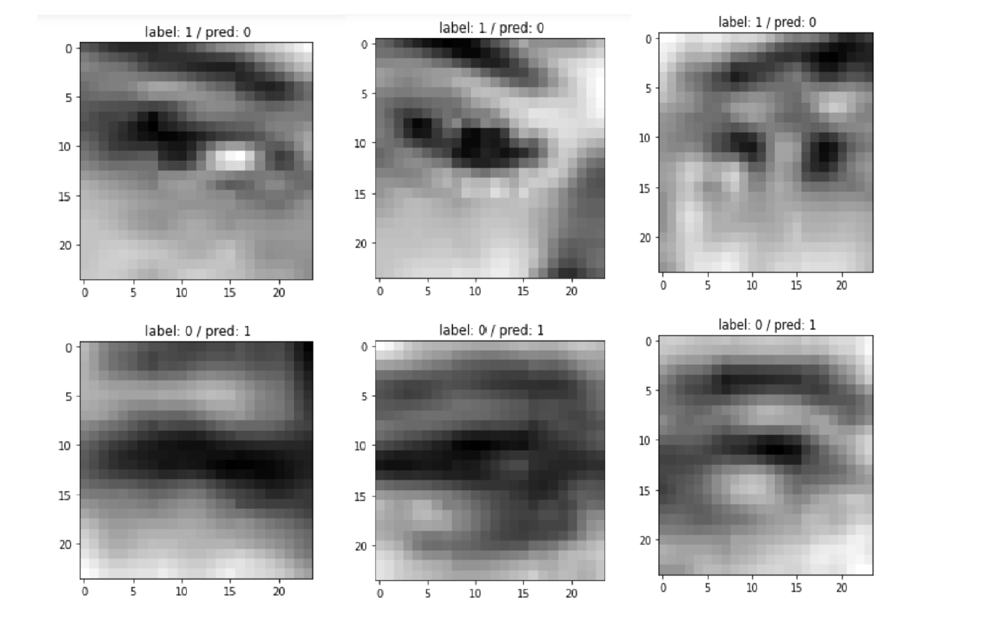
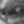
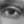
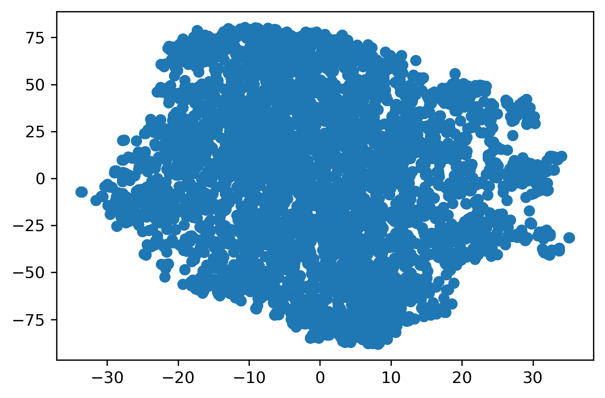
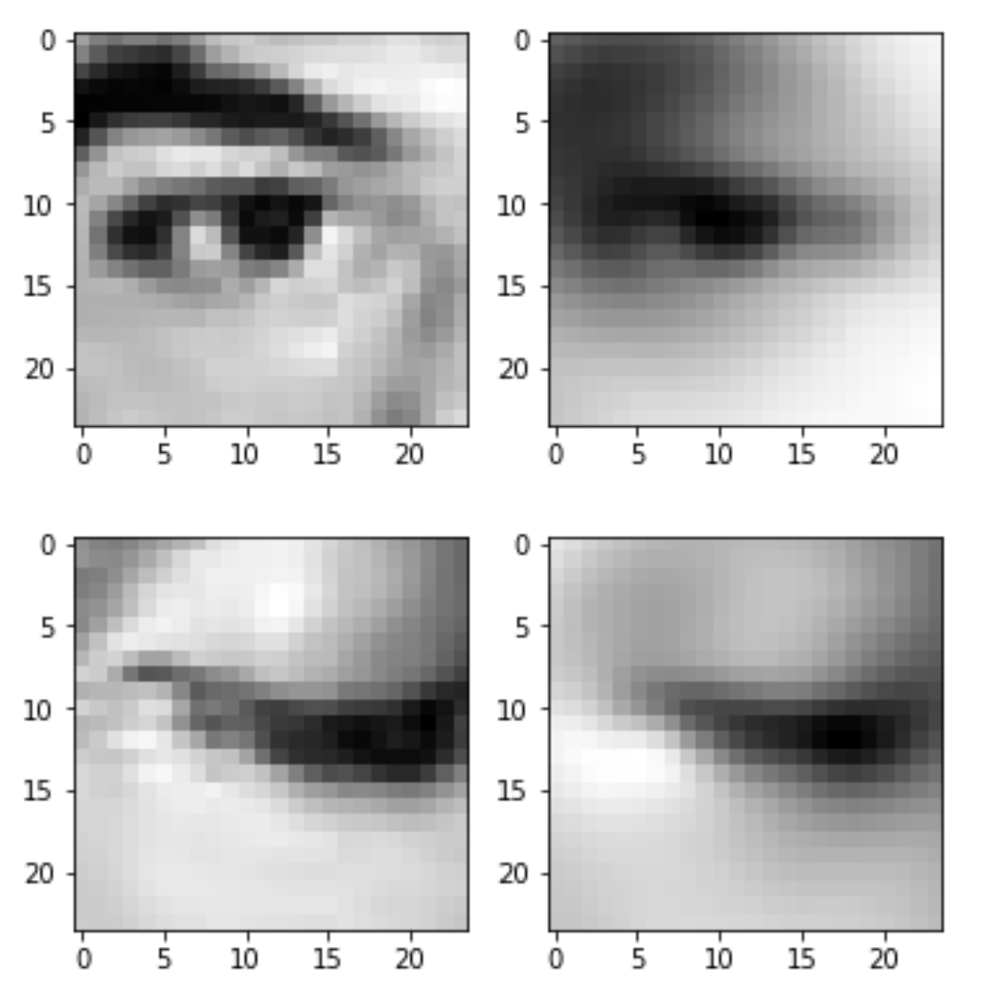
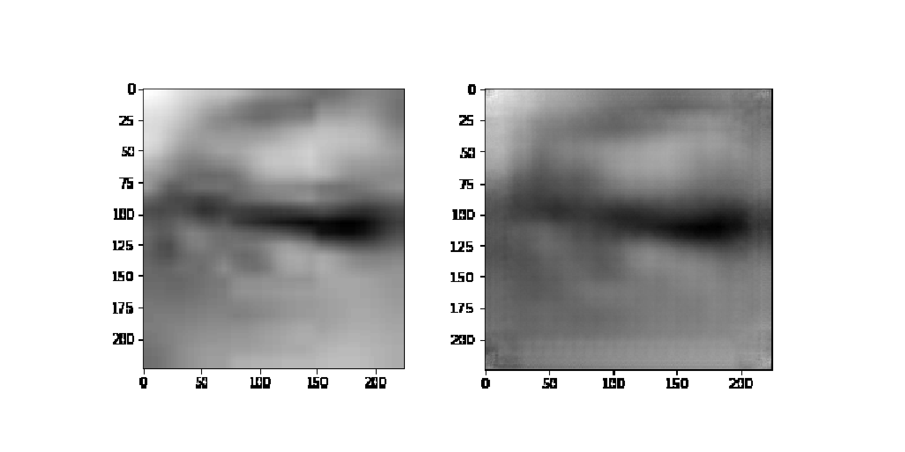
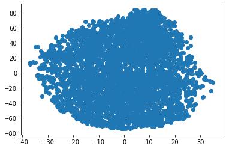

Заранее приношу свои извинения за то что отчет на англиском языке
# VisionLabs' Challenge Report


Abduragim Shtanchaev (gmail: abduragim.shtanchaev@gmail.com, tg: @Abdurahheem) 

*22.09.2020*


## Challenge description

VisionLabs's challenge formulates as follows. Given a set of 4000 eye images of size 24x24. Each image contains only one eye - which can be either closed or oponed. The task is to build a binary classifier(a function) that takes as input a full path to an image and return 0 if eye in the image, is closed and, if opened, 1. It is known that test set is from the same distribution as the training set. Main challenge of the task is that there are no lables in the dataset 


## Intersting finding
As the data set does is not provided with labels I had to create a validataion set myself. In the proccess of thinking of what would be the best way to select a representetive validatation set I started playing with ordering of images (Window OS has build in feature) and found out a very interesting peculiarity. If images are sorted by modification date then they fall in the following order: 

<br>

<center>000001.jpg - (closed eye image),  ... , 00N.jpg - (closed eye image), 00N+1.jpg - (open eye image), ... ,  004000.jpg - (open eye image) </center>

Where N equal to approximately 2000. The following pattern can be inspected visually. I do not know weather such an ordering pattern was left(by the data set creators) on purpuse or not but I decided to take an advantage of it. Using the ordering I renamed images (can be done in couple of minutes in Windows OS) in the following order:

<center>000001_0.jpg - (closed eye image),  ... , 00N_0.jpg - (closed eye image), 00N+1_1.jpg - (open eye image), ... ,  004000_1.jpg - (open eye image) </center>


As the data set is balanced, I selected 100 images with open eyes and another 100 images with closed eyes to create a validation set. The validation set is needed to assess the quality a model. I chose three assessment metrics for models: accuracy, f1 score, EER. Although the task is binary classfication with balanced classes, I decided to use f1 score along the way. And EER for estimating how sure a model is about it's missclassifications

## 1. Classification

At this point, as I knew labels for images, the challenge could be treated as a supervised classification task. I decided try the following approaches: 

      1. Classification in the original image space
      2. Classification in an embedding space

### 1.1 Classification in the original image space

Firstly I flattened all images in to vectors of length 575, then applied on those vectors simple **Logistic Regression** classifier and got the following results: 

Metric | Train | Test |
-------|-------|-------
Accuracy| 0.901  | 0.865
F1 Score | 0.893 |  0.845
EER |0.100 | 0.122

Well, not bad for simple model as logistic regression appled on the data in the original image space. Let's try something a bit  fancier, for instance **Catboot Classifer**: 

Metric | Train | Test |
-------|-------|-------
Accuracy| 0.999  | 0.895
F1 Score | 0.999 | 0.879
EER |0.000 | 0.037

Well, overfitting is present as it's expected from a tree based model. Rather than trying to reduce overfitting with catboost model, let me proceed to something a bit more involved but that might give better results and get rid of overfitting


### 1.2 Classification in an embedding space

Well done with classifiying objects in original space. Let's try to handle classification using features/embedding of some network. A prior is that objects(eyes) would be seperated in the embedding space more easily. Instead of creating new model architecture and traning it from a scratch, I decided to use a pre-trained model and fine-tune it to my problem - **Transfer Learning**. It's almost always easier to achieve better results using pre-trained models, therefore I took `ResNet-18`, changed it's head and fine tuned it. Results are: 

Metric | Train | Test |
-------|-------|-------
Accuracy| 0.997  | 0.980
F1 Score | 0.996 | 0.978
EER |0.003 | 0.028

Results are much better compared to the ones I obtained using features in the image space (Hence the assumption of better seperation in an embedding space is proved). Although training a model and inference take a bit more time but all metrics have imporoved and we got rid of overfitting by a huge margin.

One interesting fact that I have notieced is, the model makes false predictions for some samples with pretty high confidence such as following (samples from training set)





To cure that I went throught the dataset, correcting some difficults samples.  Samples that fall in to category of "difficult to classify" I put to class 0, such as this one:



And only samples that are surly  "opened eyes", such as following one, were categorized with label 1: 




Even after correcting labels in the dataset, for some samples the model makes false predictins. I can not surely tell why this happens 

## 2. Clustering


After compliting classification part I set down and thought to myself. **What would you do if you did not have this luck with modication time. What would you do if there really were no labels**. Therefore, I decived that I had to solve the problem using proper methods. I considered the follwoing ones: 

    1. Clustering in Image Space
    2. PCA Approach 
    3. SVD Approach
    4. Clustering in Embedding Space 
    5. Domain Adaptation Approach

### 2.1 Clustering in Image Space

First algorithm that pop up to my mind is **k means** clustering. I flattened the images to vectors as in paragraph 1.1 and conducted clustering using k-means clustring algorithm

Metric | Train | Test |
-------|-------|-------
Accuracy| 0.619  | 0.605
F1 Score | 0.617 |  0.614
EER |NaN | NaN


EER was not calculated as k-means does not provide prediction probas and anyway the results are no satifyting. A little better than random guess

### 2.2 PCA Approach 

Next idea was to reduce dimentionality using PCA after that conduct clustering. Playing with different parameters I got best results with `n_components` = 300 for PCA

Metric | Train | Test |
-------|-------|-------
Accuracy| 0.638  | 0.625
F1 Score | 0.650 |  0.644
EER |NaN | NaN


Althougth I do not trust myself using TSNE (as the results of tsne dimentionality reduction depend greatly on perplexity parameter. Have a look on this [excellent post](https://distill.pub/2016/misread-tsne/) about TSNE on distill.pub), I decided to give it a try, just to visualize the features after PCA. On the image below we can see that there is only one single cluster. So PCA, most probably, does not seperate data in higher dimentions either 




PCA imporved resutls a just a bit. But those results are not the ones I am aming for, so I proceeded to a next approach

### 2.3 SVD Approach

If you take a look on images carefully, then you will come to a conclusion that there is a lot of redundant information for the task of clustering. What I mean is following, in order to determine if an eye is closed or open one does not need very detailed information as in the original image. See the examples below:



So the basic idea was is find all high friqunacy details in every image and only use them in clustering task.  This can be done easy using $SVD$ decomposion. I am not going into the details how its done - as the procedure is pretty simple, and if one needs details take a look at the [git repo](https://github.com/Abdurrahheem/VisionLabs-Challenge.git) of this project 


Metric | Train | Test |
-------|-------|-------
Accuracy| 0.620  | 0.61
F1 Score | 0.619 |  0.621
EER |NaN | NaN


Neahh, does not work. I iteratively foud the number of componests(in SVD) that maximize the metrics, never the less, could not get what I was hoping for - something aroud ~ 0.8 accuracy 


### 2.4 Clustering in Embedding Space 

The best I achieved by clustering in the original space was `accuracy: 0.625, f1 score: 0.644` on validation set. Let's try now using fancier features than just row pixels and their linear tranformations. I took pre-trained model `ResNet-34`, changed it's last layer to identity layer, computer features and conducted clustering using k-means algorithm


Metric | Train | Test |
-------|-------|-------
Accuracy| 0.609  |0.605
F1 Score | 0.607 |  0.622
EER |NaN | NaN


Clustering on features of pre-trained model gave me results a bit better than a random guess. Therefore, as a next step, I decided to train a Autoencoder using pre-trianed backbone - `squeezenet` as its light and has good classification metric on ImageNet data set. Achieved recostruction of the following quality on a test set (left orignal image, right the reconstraction)




I expected that the test set embeddings will be seperable. The visualization of the test set embeddings(using t-sne) is illustrated on the image below. There is only cluster, hence I got bad resutls of classification after clustering. I won't report these results here as they are below the best result we have



### 2.5 Domain Adaptation Approach


At this point I was kind of diappointed and loosing hope. I started searching for other solutions in the internet and came across [this paper](https://arxiv.org/abs/1409.7495) by Yaroslav Ganin and Victor Lempitsky on Unsupervised Domain Adaptation by Backpropagation. I read the paper and the basic idea behind it, is to train a model on dateset (source dataset) that is similar to the one at on hands(target dataset) but has a shift. During training the model learns discriminative and domain invarient features in it's feature extractor part. At the test time those features can be used to predict labels of unlabeled data set.


I found a [similar dataset](http://mrl.cs.vsb.cz/eyedataset) to the one we have. Images in that daset are a bit larger 34x34 and cover more face area than our images. I had to resize, center croped and normolized them to make them as similar as possible to our images. Also, the size of the dataset is way bigger that ours, ~88,000 to 4,000 images, but the diversity of our data set is broader (in my opinion). There are only 37 participant's eyes in RML EYE dataset. This is how images look like after transformation 


Then I have implemented the paper and trained using the scheme described in the paper. So fat I could not achieve reported improvements of results. Visualization (using t-sne) the features of the source and target dataset is below:


As we can see I am doing something wrong while training, as features are not domain invarient (blue one are from source ds. and orenge ones from target, sorry forgot to add legends on the figure). Probaly I wou't be able to set the training to work properly before the deadline but I expect classification accuracy on traget test set  ~0.8 at least (accorgind the estimats in the paper), after getting the algorithm to work. 

## 3. Conclusion


All in all, in this work I have cosidered two ways to solve the problem.

    1. Supervised learning gave the following results
    
Metric | Train | Test |
-------|-------|-------
Accuracy| 0.997  | 0.980
F1 Score | 0.996 | 0.978
EER |0.003 | 0.028

    2. Unsupervised learning method yeilded 
    
Metric | Train | Test |
-------|-------|-------
Accuracy| 0.638  | 0.625
F1 Score | 0.650 |  0.644
    
    In unsupervised learing approach, the best results should have been achieved by Domain Adaption technique. As to limitation of time, so far I did not get similar metrics as in the original paper. In oder to meet the deadlien I have to submit the work as it is. Hope that the attempts will be also considered in the final decition
    
#### More info 

* To view all the source code for this work visit the [github repo](https://github.com/Abdurrahheem/VisionLabs-Challenge)
* To recreate the evironment see `enviroment.yml` conda package file
* To make inferece using best classification model use function `openEyeCheck()` function of the `EyeClassifier.py`. Pass in a full path to your eye image as an argument into to `openEyeCheck()` function


```python

```
